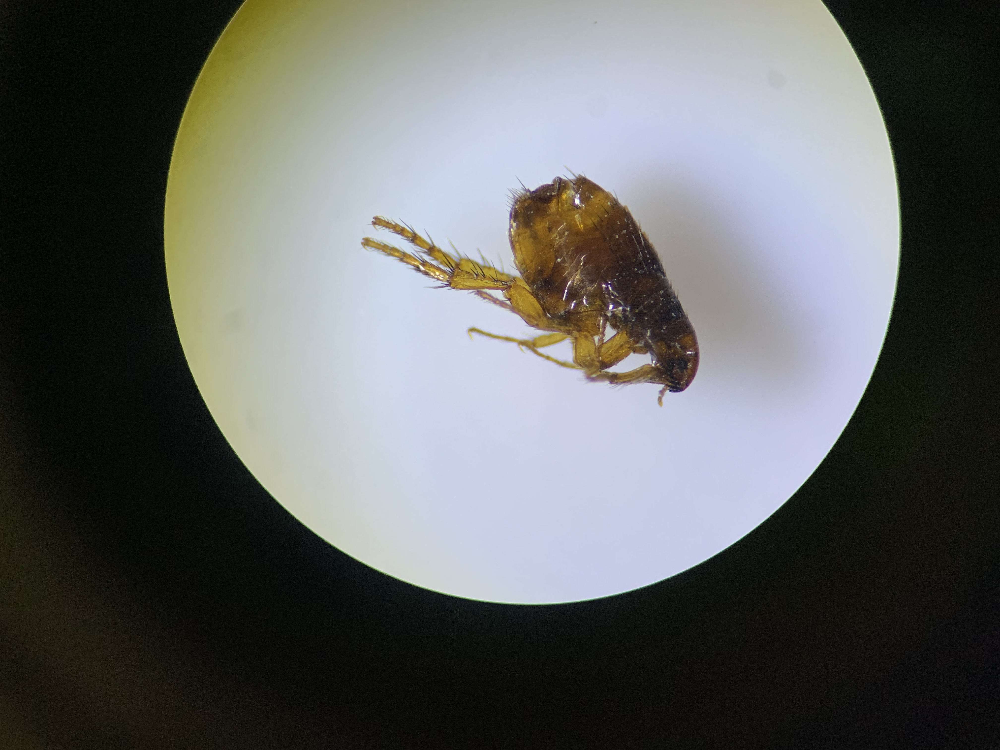

# Cat-vs-Dog-Flea
    This project is about building a deep learning model that predicts whether an image is of cat or dog fleas. The model was trained using TensorFlow/Keras with image preprocessing and augmentation techniques.

**Dataset**

    The dataset contains images of cats fleas and dogs fleas.
    Data was split into 75% training and 25% testing.

**Workflow**

    Data Preprocessing
    Images resized and normalized.
    Applied augmentation for better generalization.
    Model Building
    CNN (Convolutional Neural Network) with Conv2D, MaxPooling, BatchNorm, Dropout.
    Compiled and trained with TensorFlow/Keras.

**Training**

    Used Early Stopping to prevent overfitting.
    Achieved good separation between flea vs non-flea images.

**Evaluation**

    Model tested on unseen images (cats and dogs fleas).
    Predictions were consistent with visual results.

Here is an image of a flea

